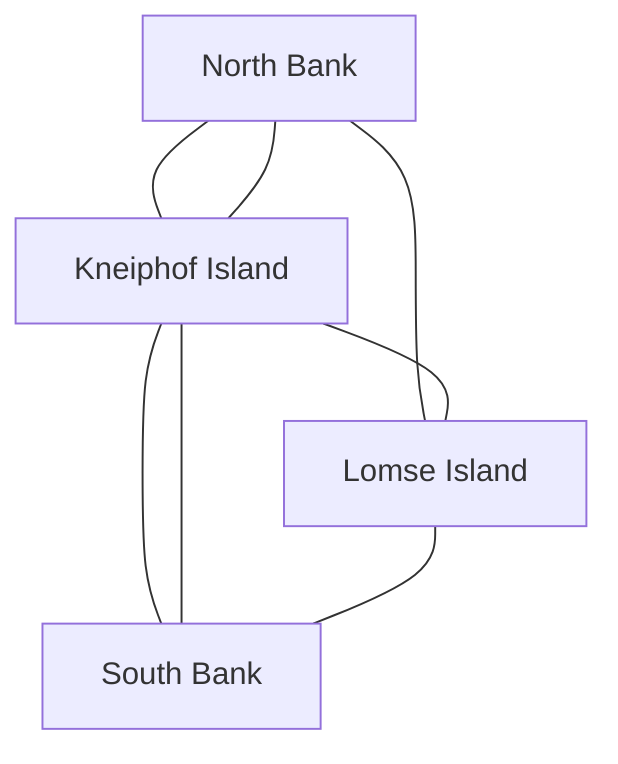
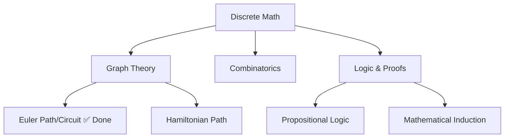

# relive-to-learn

**Don't teach knowledge — let learners relive its discovery, invention, and dialogue.**

Traditional teaching starts from conclusions — open a textbook, chapter one is definitions. But knowledge was never born to be "learned." It was born to solve a dilemma that could no longer be avoided.

This Claude Code Skill puts the learner back at the scene of that dilemma, as the person who must make the choice.

---

## Four Teaching Modes

| Mode | Domain | Archetype | Core Question |
|------|--------|-----------|---------------|
| **Discoverer** | Math & science | Scientist uncovering nature's secrets | Why is the world this way? |
| **Engineer** | Tech stacks | Inventor solving engineering pain | How to do it more effectively? |
| **Dialoguer** | Humanities debates | Entering a millennia-old conversation | How should we understand and choose? |
| **Deep Diver** | Classic works | Entering an author's mind | What is this author really saying? |

---

## Quick Start

In any directory:

```
/study [what you want to learn]
```

The skill auto-detects the discipline and routes to the right mode. Examples:

```
/study discrete math    → auto-detects as Discoverer mode
/study C++              → auto-detects as Engineer mode
/study philosophy of law → auto-detects as Dialoguer mode
/study Zhuangzi          → auto-detects as Deep Diver mode
```

You can also manually specify: "use Engineer mode for graph theory".

---

## How to Use

### Interaction During Learning

The CLI terminal is for **dialogue only** — questions, answers, brief guidance. All teaching content (derivations, formulas, diagrams, code, arguments) is written in real-time to an Obsidian vault blackboard file. Open the file in Obsidian to see beautifully rendered LaTeX formulas and mermaid diagrams.

### Knowledge Cards and Branching

Whenever you make a meaningful "branch choice" during learning (choosing a derivation path, a design approach, engaging with a sage, selecting an annotation interpretation), the skill cuts the relevant content from the blackboard and auto-generates a knowledge card. Each card has bidirectional links, forming your personal knowledge network — viewable in Obsidian's graph view.

### Resuming a Previous Session

When tokens run out or you need a new session:

1. Open the **same working directory**
2. Type `/study [same topic]`
3. The skill detects `.study/state.json` and auto-resumes
4. It tells you where you left off and what's still on the blackboard

**No manual steps required.** All learning state lives in the filesystem, not in session memory.

### Obsidian Vault Structure

The following directories and files are auto-created:

```
working-directory/
├── 00-总览仪表盘/           # Dashboard
│   └── 索引.md               # Entry index linking all topics
├── 10-理论学习/              # Discoverer mode output
│   └── [topic]/
│       ├── [板书]-实时笔记.md  # Current blackboard (unsplit content)
│       └── [知识点]-[name].md # Split knowledge cards
├── 20-工具栈/                # Engineer mode output
├── 30-文科论题/              # Dialoguer mode output
├── 40-经典专著/              # Deep Diver mode output
├── 50-演示模型/              # Demo code
└── .study/                   # Learning state (gitignored)
    ├── state.json            # Progress tracking
    ├── errors.md             # Error log
    └── questions.md          # Question log
```

Open the working directory in Obsidian to see your complete knowledge graph.

---

## Blackboard Example

After `/study discrete math`, open the blackboard file in Obsidian:

```markdown
# Discrete Math · Blackboard

## Stage 1: The Telegram

**Time:** Spring, 1736
**Place:** Königsberg, Prussia
**You are:** Leonhard Euler, 29

The city spans the Pregel River. Seven bridges connect four regions:



> *Dear Mr. Euler, can one walk across all seven bridges exactly once and return home?*

## Stage 5: Co-Derivation

### Step 3: Odd-Degree Vertices

$$
\deg(v) \equiv 1 \pmod{2} \quad\Rightarrow\quad \text{must be start or end point}
$$

### Theorem Statement

> **Euler's Theorem (1736)**
> A connected graph has an Eulerian path **iff** it has exactly **0 or 2** odd-degree vertices.

## Discrete Math Landscape


```

> Real learning session output. CLI shows brief dialogue; Obsidian renders mermaid diagrams, LaTeX, and structured knowledge.

---

## Core Principles

1. **Start from a dilemma, not a definition** — begin with a letter, a paradox, an engineering pain, or a raw text
2. **Assume the learner knows nothing** — every unfamiliar term is translated before being introduced
3. **The learner makes the choices** — the skill is a midwife, not an answer key
4. **Ask before producing** — demos, knowledge cards, reports — always ask "want me to?"
5. **Crystallize learning into a knowledge base** — Obsidian-linked notes + Git version control

---

## Installation

```bash
cp SKILL.md ~/.claude/skills/study/SKILL.md
cp -r references/ ~/.claude/skills/study/references/
```

## License

MIT
