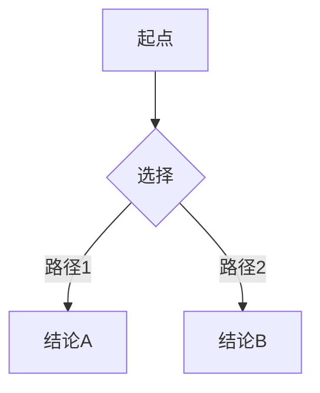

# Obsidian 实时渲染与知识卡片拆分 实现计划

> **For agentic workers:** REQUIRED SUB-SKILL: Use superpowers:subagent-driven-development (recommended) or superpowers:executing-plans to implement this plan task-by-task. Steps use checkbox (`- [ ]`) syntax for tracking.

**Goal:** CLI 只做对话，所有公式/图表/推导/代码/论证实时写入 Obsidian vault；分支选择点触发知识卡片拆分，建立双向链接网络。

**Architecture:** 在现有 skill 基础上新增三层规则——输出路由（决定什么进 CLI 什么进文件）、文件模型（`[模式]/[主题]/[板书]/[知识点]` 结构）、教学技巧（挖坑与递进）。改动集中在 SKILL.md 和 4 个 reference 文件，其余 5 个文件不变。

**Tech Stack:** Claude Code Skill 系统（Markdown），无外部依赖。

---

### Task 1: 更新 obsidian-notes.md（新文件模型 + 双链规范）

**Files:**
- Modify: `references/obsidian-notes.md`

- [ ] **Step 1: 替换文件结构部分**

将当前第 3-19 行的旧结构替换为新的 `[模式]/[主题]/[板书]/[知识点]` 模型，并新增双向链接 frontmatter 规范。

将整个文件替换为：

```markdown
# Obsidian 笔记格式规范

## 文件夹结构

```
Obsidian Vault/
├── 00-总览仪表盘/
│   └── 索引.md                    # 入口索引，按模式/主题分类
├── 10-理论学习/                   # 发现者模式产出
│   └── [主题名]/
│       ├── [板书]-实时笔记.md      # 唯一黑板，未拆分内容
│       └── [知识点]-[名称].md     # 已拆分知识卡片
├── 20-工具栈/                     # 工程师模式产出
│   └── [主题名]/
│       ├── [板书]-实时笔记.md
│       └── [知识点]-[名称].md
├── 30-文科论题/                   # 对话者模式产出
│   └── [主题名]/
│       ├── [板书]-实时笔记.md
│       └── [知识点]-[名称].md
├── 40-经典专著/                   # 深度潜入者模式产出
│   └── [主题名]/
│       ├── [板书]-实时笔记.md
│       └── [知识点]-[名称].md
└── 50-演示模型/                   # 演示代码归档
    └── [主题]/[模型名].py
```

## 文件名规范

- `[板书]-实时笔记.md`：当前会话的黑板文件。每次回复追加内容。分支点触发时，相关内容被剪切为知识卡片，原位置替换为链接。
- `[知识点]-[名称].md`：独立知识卡片。名称用简短的英文或中文概括该知识点。
- `[主题名]/`：学习主题的子文件夹，在首次启动时根据用户输入的主题名自动创建。

## 双向链接 frontmatter

每张知识卡片必须包含以下 frontmatter：

```yaml
---
tags: [模式, 主题, 子话题]
difficulty: 初|中|高
mode: [discoverer|engineer|dialoguer|deep_diver]
previous: "[[上一个知识点]]"
next: null
branch_of: "[[主题名]]"
created_at: "2026-06-03T12:00:00"
---
```

- `previous`：拆分生成时自动指向上一个已拆分的卡片，形成学习链
- `next`：下一张卡片生成时回填，`null` 表示当前链尾
- `branch_of`：指向主题总览页或索引

## 板书文件拆分标记

在 `[板书]-实时笔记.md` 中，已被拆分为卡片的内容替换为：

```markdown
→ 已拆分：[[知识点-名称]]
```

## 00-总览仪表盘/索引.md 格式

```markdown
# 学习索引

> 自动更新于 [日期]

## 理论学习
- **[主题名]**：[[知识点-A]] → [[知识点-B]] → [[知识点-C]]

## 工具栈
## 文科论题
## 经典专著
```

## 发现者模式知识卡片模板

```markdown
---
tags: [学科标签, 发现者模式]
difficulty: 初|中|高
mode: discoverer
history_period: "[年代]"
scientist: "[科学家名]"
previous: "[[上一个知识点]]"
next: null
branch_of: "[[主题名]]"
created_at: "[时间戳]"
---

# [知识点名称]

## 分支选择
[用户当时的选择 + 理由]

## 核心推导
[用户自己推导出的关键逻辑步骤]

## 最终定理
[用户完成推导后对比的历史原文]

## 跨学科桥梁
- [[关联学科A]]
- [[关联学科B]]

## 待探究
- [ ] [后续可探索的问题]
```

## 工程师模式知识卡片模板

```markdown
---
tags: [技术标签, 工程师模式]
difficulty: 初|中|高
mode: engineer
design_principle: "核心设计思想"
previous: "[[上一个知识点]]"
next: null
branch_of: "[[主题名]]"
created_at: "[时间戳]"
---

# [知识点名称]

## 分支选择
[用户当时的设计取舍 + 理由]

## 工程痛点
[触发该设计的具体痛点]

## 最小示例
```[语言]
[核心代码]
```

## 代码评审记录
### 原始代码
[用户提交的代码]

### 四维诊断
- 语法：
- 逻辑：
- 规范：
- 设计：

### 最终代码
[评审后修改的代码]

## 进阶路径
- [ ] [拓展选题1]
- [ ] [拓展选题2]
```

## 对话者模式知识卡片模板

```markdown
---
tags: [论题标签, 对话者模式]
mode: dialoguer
eternal_question: "永恒之问"
sages_encountered: [先贤列表]
previous: "[[上一个知识点]]"
next: null
branch_of: "[[主题名]]"
created_at: "[时间戳]"
---

# [知识点名称]

## 分支选择
[立场/辩论切换]

## 先贤论证
### [先贤名] ([年代])
- 核心论证：
- 我的反驳：
- 先贤回应：

## 我的当前立场
[此阶段的论证位置]
```

## 深度潜入者模式知识卡片模板

```markdown
---
tags: [经典名称, 深度潜入者模式]
mode: deep_diver
classic: "[书名]"
author: "[作者]"
era: "[成书年代]"
previous: "[[上一个知识点]]"
next: null
branch_of: "[[主题名]]"
created_at: "[时间戳]"
---

# [知识点名称]

## 分支选择
[注疏选择 + 理由 / 对话回应 / 创作形式]

## 原文
> [原文引用]

## 素读初感
[用户第一次阅读时的直接感受和困惑]

## 深度理解
[围绕困惑展开的注疏和理解路径]

## 与我的相遇
[经典与用户个人生命经验的关联]

## 我的创作
[用户的内化作品]
```
```

- [ ] **Step 2: 提交**

```bash
cd "D:/Users/13960/Desktop/claude/高级教师skill" && git add references/obsidian-notes.md && git commit -m "update: [模式]/[主题]/[板书]/[知识点]文件模型与双链frontmatter"
```

---

### Task 2: 更新 state-schema.md（新增追踪字段）

**Files:**
- Modify: `references/state-schema.md`

- [ ] **Step 1: 新增顶层追踪字段**

在顶层 JSON 字段中，第 17 行 `"cycle_count": 0,` 之后插入新的追踪字段：

打开 `references/state-schema.md`，将顶层字段 JSON 块（第 5-24 行）替换为：

````markdown
```json
{
  "topic": "用户当前学习的主题",
  "mode": "discoverer | engineer | dialoguer | deep_diver",
  "phase": "diagnosis | teaching",
  "vault": {
    "mode_folder": "10-理论学习",
    "topic_folder": "[模式文件夹]/[主题名]",
    "blackboard_file": "[主题名]/[板书]-实时笔记.md",
    "index_file": "00-总览仪表盘/索引.md",
    "last_card_file": "上一个拆分的卡片路径"
  },
  "split_cards": [
    {"file": "[知识点]-[名称].md", "title": "[名称]", "created_at": "..."}
  ],
  "current_node": "当前正在进行的教学节点名",
  "completed_nodes": [
    {"name": "节点名", "completed_at": "2026-05-28"}
  ],
  "spiral_queue": [
    {"node": "节点名", "round": 2, "after_cycle": 3}
  ],
  "question_counts": {"知识点": 提问次数},
  "cycle_count": 0,
  "discoverer": { ... },
  "engineer": { ... },
  "dialoguer": { ... },
  "deep_diver": { ... }
}
```
````

- [ ] **Step 2: 在文件末尾新增 vault 字段说明**

在文件末尾新增：

```markdown
## vault 追踪字段说明

### vault 对象

| 字段 | 说明 |
|------|------|
| `mode_folder` | 当前模式对应的顶层文件夹（10-理论学习/20-工具栈/30-文科论题/40-经典专著） |
| `topic_folder` | 当前主题的子文件夹完整路径 |
| `blackboard_file` | 当前板书文件路径，每次回复追加写入 |
| `index_file` | 索引文件路径 |
| `last_card_file` | 最近一张拆分出的卡片路径，用于设置下一张的 `previous` 链接 |

### split_cards 数组

每次分支拆分时追加一条记录，用于追踪学习链。

```json
{
  "file": "[知识点]-欧拉回路.md",
  "title": "欧拉回路",
  "created_at": "2026-06-03T12:30:00"
}
```
```

- [ ] **Step 3: 提交**

```bash
cd "D:/Users/13960/Desktop/claude/高级教师skill" && git add references/state-schema.md && git commit -m "update: vault追踪字段与split_cards数组"
```

---

### Task 3: 更新 translation-layer.md（写文件格式约束）

**Files:**
- Modify: `references/translation-layer.md`

- [ ] **Step 1: 在文件末尾新增格式约束节**

在 `references/translation-layer.md` 末尾追加：

```markdown
---

## 写 Obsidian 文件时的格式约束

当教学内容写入 vault 笔记文件时，必须使用以下格式以确保 Obsidian 正确渲染：

### LaTeX 公式

行内公式用 `$...$`，块级公式用 `$$...$$`：

```markdown
行内：欧拉发现了 $V - E + F = 2$ 这个关系。

块级：
$$
\sum_{v \in V} \deg(v) = 2|E|
$$
```

### mermaid 图表

使用 ` ```mermaid` 代码块：

```markdown

```

### 代码块

超过 5 行的代码必须用带语言标识的代码块包裹：

```markdown
```cpp
int main() {
    // ...
}
```
```

### 双链引用

引用 vault 内其他笔记用 `[[文件名]]`，Obsidian 自动识别。

### 步骤编号与推导链

推导步骤用 `**步骤N：**` 标注，保持逻辑链清晰：

```markdown
**步骤1：** 观察到 [观察]

**步骤2：** 这意味着 [推论]

**步骤3：** 因此 [结论]
```
```

- [ ] **Step 2: 提交**

```bash
cd "D:/Users/13960/Desktop/claude/高级教师skill" && git add references/translation-layer.md && git commit -m "add: 写Obsidian文件时的LaTeX/mermaid格式约束"
```

---

### Task 4: 更新 engineer.md（阶段四代码评审 + 分支拆分）

**Files:**
- Modify: `references/engineer.md`

- [ ] **Step 1: 将阶段四的四维诊断升级为正式代码评审流程**

找到阶段四的步骤三（第 152-165 行，"用户提交代码后四维诊断"），替换为：

```markdown
#### 步骤三：用户提交代码后代码评审

用户提交代码后，执行四维诊断。**诊断内容全部写入 `[板书]-实时笔记.md`，CLI 只给简短引导。**

诊断写入格式：

```markdown
## 代码评审 — [题目描述]

### 原始代码
```[语言]
[用户提交的代码]
```

### 四维诊断

#### 1. 语法问题
[具体位置 + 修正方案。无问题则写"未发现语法问题。"]

#### 2. 逻辑问题
[为什么不对 + 正确思路。无问题则写"未发现逻辑问题。"]

#### 3. 语言规范
- 命名：[问题 + 建议]
- const 正确性：[检查]
- RAII/所有权：[检查]
- 惯用法：[是否符合该语言的惯用写法]

#### 4. 设计改进
> "如果现在要加 [新需求]，你的设计要改多少？"
[扩展性评估]

### 优化建议
[1-2 条最关键的改进建议，每条一行]
```

CLI 引导语：

> "代码评审已写入 `[板书文件路径]`。打开 Obsidian 看看——有几个地方值得关注。"

#### 步骤四：评审通过后触发分支拆分

当代码通过评审（无语法/逻辑问题，规范基本达标）时：

1. 从 `[板书]-实时笔记.md` 中剪切完整的代码评审内容
2. 生成 `[知识点]-[代码评审-题目].md`，写入代码评审报告
3. 原位置替换为 `→ 已拆分：[[知识点-代码评审-题目]]`
4. 设置 frontmatter 双链，更新 `00-总览仪表盘/索引.md`
5. CLI 告知："这一轮已存档为知识卡片。"

然后继续变式挑战（原步骤五）。

#### 步骤五：挖坑式变式挑战

在给变式挑战时，可以刻意埋入一个典型陷阱（如边界条件、所有权转移、资源释放时机）：

CLI：
> "现在换个花样：把 [需求] 改动一下。不过提示你——这个改动有个经典的坑，看你能不能发现。"
```

- [ ] **Step 2: 重新编号原步骤四、步骤五**

将原步骤四（类比解释错误）编号为步骤六，原步骤五（变式挑战）编号为步骤七。内容不变。

- [ ] **Step 3: 提交**

```bash
cd "D:/Users/13960/Desktop/claude/高级教师skill" && git add references/engineer.md && git commit -m "update: 阶段四代码评审写Obsidian+分支拆分+挖坑变式"
```

---

### Task 5: 更新 SKILL.md（新增三节 + 修改会话启动）

**Files:**
- Modify: `SKILL.md`

- [ ] **Step 1: 修改会话启动（新增主题文件夹创建 + 板书文件初始化）**

在第 6 步（初始化 errors.md）之后，新增第 7 步。修改 "### 首次启动" 中的第 5-6 行，以及新增第 7 步。

找到第 57-60 行：
```
4. 进入学科识别流程（见下文）
5. 初始化 `state.json`（格式见 `references/state-schema.md`）
6. 初始化 `errors.md` 和 `questions.md`
```

替换为：

```markdown
4. 进入学科识别流程（见下文），确认模式和主题后：
   a. 创建主题子文件夹：`mkdir -p [模式文件夹]/[主题名]`
   b. 创建板书文件：`[模式文件夹]/[主题名]/[板书]-实时笔记.md`，写入初始标题
   c. 初始化/更新 `00-总览仪表盘/索引.md`
5. 初始化 `state.json`（格式见 `references/state-schema.md`），写入 vault 追踪字段
6. 初始化 `errors.md` 和 `questions.md`
7. 创建 `00-总览仪表盘/索引.md`（若不存在），追加当前主题条目
```

- [ ] **Step 2: 在"五大铁律"之后插入"输出路由规则"节**

找到第 138 行（"## 通用交互协议" 之前），插入：

```markdown
---

## 输出路由规则

### CLI 只用来对话

以下内容直接在 CLI 以简短文本输出：
- 提问（"你怎么看？""选哪条路？"）
- 简短引导（"推导已写入笔记，打开 `[路径]` 看看"）
- 确认/反馈（"对，这就是关键"）
- 模式识别问题和确认
- 费曼检验提问

### 教学内容写到 Obsidian

以下内容**不输出到 CLI**，而是写入当前 `[板书]-实时笔记.md`：
- LaTeX 公式（块级或行内）
- mermaid 图表
- 超过 3 行的推导过程
- 超过 5 行的代码块
- 超过 2 句的先贤原文引用
- 代码评审报告
- 知识树/对比表/时间轴/演变轨迹图

### 每次回复的流程

1. CLI 给出简短对话文本（引导、提问、确认）——保持 1-3 句话
2. 将本次的教学内容写入 `[板书]-实时笔记.md`（使用 `references/translation-layer.md` 定义的格式）
3. 告知用户文件路径，CLI 格式："相关内容已写入 `[相对路径]`"

### 写文件格式

遵循 `references/translation-layer.md` 的格式约束：
- LaTeX 用 `$...$` 或 `$$...$$`
- mermaid 用 ` ```mermaid`
- 代码块带语言标识

---

## 分支拆分与知识卡片

### 拆分触发时机

每当用户在教学流程中做出一个有意义的"分支选择"时，触发拆分：

| 模式 | 触发点 |
|------|--------|
| **发现者** | 阶段四选择路径、阶段五每步关键推导完成、阶段六选涟漪方向 |
| **工程师** | 阶段二设计取舍、阶段四代码评审通过（每次变式挑战完成后）、阶段六选拓展 |
| **对话者** | 阶段二初始立场、每位先贤辩论结束/切换下一位 |
| **深度潜入者** | 阶段三选注疏、阶段四每次对话回应、阶段五选创作形式 |

### 拆分操作

1. 从 `[板书]-实时笔记.md` 中**剪切**该分支点相关的内容
2. 生成 `[知识点]-[名称].md`，写入内容 + frontmatter（含 `previous`/`next`/`branch_of`）
3. 原位置替换为 `→ 已拆分：[[知识点-名称]]`
4. 新卡片的 `previous` 设为 `state.json` 中 `vault.last_card_file`
5. 若 `last_card_file` 存在，回填其 `next` 字段为当前新卡片
6. 更新 `state.json`：`split_cards` 追加记录，`vault.last_card_file` 设为当前卡片
7. 更新 `00-总览仪表盘/索引.md`：在当前主题行追加 `→ [[知识点-名称]]`

### 不拆分的情况

- 短问答、未形成完整判断的探索性对话
- 翻译层展开的小讲座
- 费曼检验问答

这些内容留在黑板上，不触发拆分。

---

## 挖坑与递进原则（所有模式共享）

### 挖坑原则

教学过程中，主动识别当前知识点最常见的误解，设计场景让用户自然掉进去。

**挖坑三步：**

1. **预设陷阱**：在提问或代码框架中，刻意埋入一个看似正确但隐藏典型错误的设定。以平常语气给出，不提示"这里有坑"。
2. **让坑暴露**：用户给出错误答案/代码后，不立即纠正。让后果自然展开——代码跑崩、逻辑矛盾、推导卡住。
3. **爬坑即学会**：用户意识到不对劲后，Skill 揭示："你刚才踩的坑，核心原因是 [原理]。这也是 [历史人物/场景] 曾经犯过的同样错误。"

**挖坑时机：**
- 发现者：推导中在用户可能跳过关键假设的地方设问
- 工程师：代码框架中埋入典型内存/所有权/边界错误
- 对话者：用某先贤的反驳恰好击中用户论证的薄弱点
- 深度潜入者：引入一个看似合理但与原意相反的误导性解读

### 由浅入深原则

任何概念的讲解必须经过至少两个层次：

1. **第一层：最小可行理解**——给最简单的情况（最小规模、零边界条件），让用户先跑通、先有手感。
2. **用户撞到边界**——给出一个超出简单模型范围的新输入："刚才的方法还管用吗？"
3. **第二层：引入复杂性**——用户意识到不够用后，自然引出更完整的模型。

**禁止行为：** 一次给完整定义。完整定义是终点，不是起点。
```

- [ ] **Step 3: 提交**

```bash
cd "D:/Users/13960/Desktop/claude/高级教师skill" && git add SKILL.md && git commit -m "add: 输出路由规则、分支拆分、挖坑递进三节"
```

---

### Task 6: 同步全局安装 + 最终验证

**Files:**
- 同步: `C:/Users/13960/.claude/skills/study/` 下所有修改过的文件

- [ ] **Step 1: 同步到全局安装目录**

```bash
cp "D:/Users/13960/Desktop/claude/高级教师skill/SKILL.md" "C:/Users/13960/.claude/skills/study/SKILL.md"
cp "D:/Users/13960/Desktop/claude/高级教师skill/references/obsidian-notes.md" "C:/Users/13960/.claude/skills/study/references/obsidian-notes.md"
cp "D:/Users/13960/Desktop/claude/高级教师skill/references/state-schema.md" "C:/Users/13960/.claude/skills/study/references/state-schema.md"
cp "D:/Users/13960/Desktop/claude/高级教师skill/references/translation-layer.md" "C:/Users/13960/.claude/skills/study/references/translation-layer.md"
cp "D:/Users/13960/Desktop/claude/高级教师skill/references/engineer.md" "C:/Users/13960/.claude/skills/study/references/engineer.md"
```

- [ ] **Step 2: 验证文件完整性**

```bash
echo "=== 全局安装目录 ===" && ls -la "C:/Users/13960/.claude/skills/study/SKILL.md" && ls -la "C:/Users/13960/.claude/skills/study/references/" && echo "" && echo "=== 新增内容验证 ===" && grep -c "输出路由规则\|分支拆分与知识卡片\|挖坑与递进原则" "C:/Users/13960/.claude/skills/study/SKILL.md"
```

Expected: 3 (one match for each new section header)

- [ ] **Step 3: 最终提交**

```bash
cd "D:/Users/13960/Desktop/claude/高级教师skill" && git add -A && git status && git commit -m "complete: Obsidian实时渲染+分支拆分+挖坑递进——v2.0"
```
```

注意：以上是计划内容。实际实现中如遇到代码示例位置偏移，以当前文件实际行号为准。
