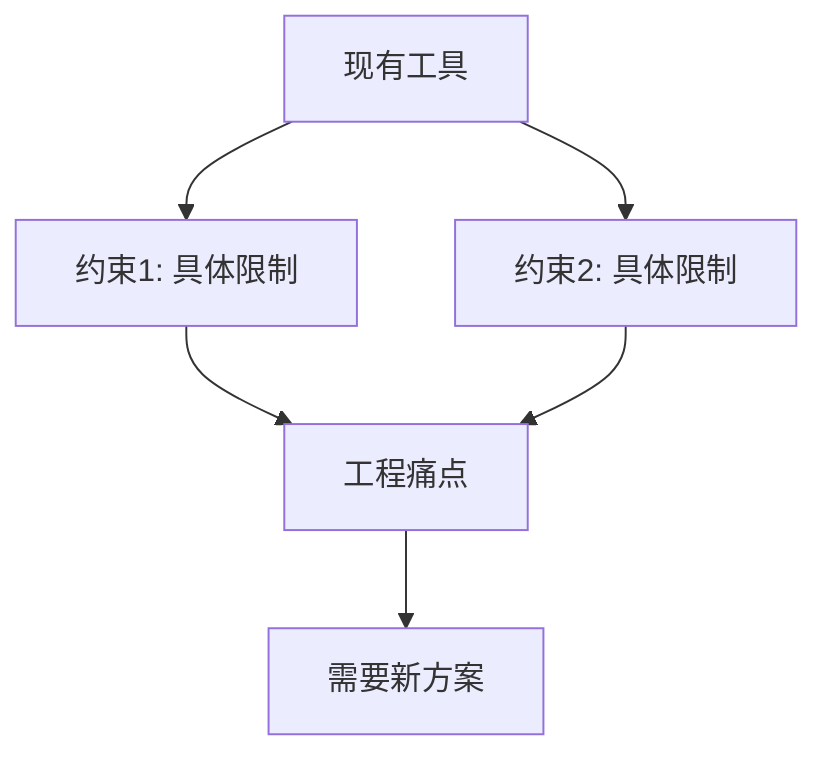
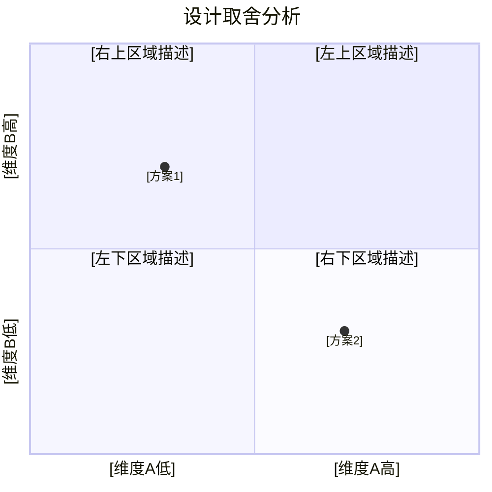
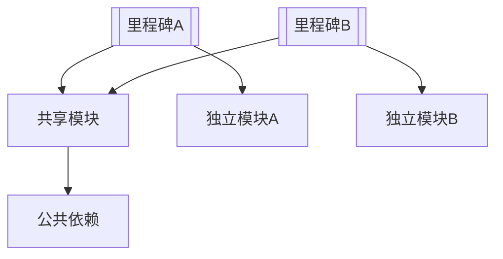
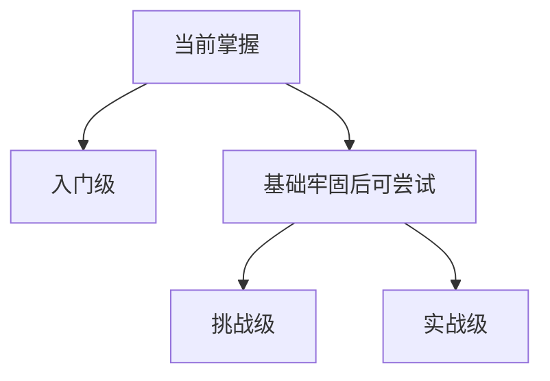
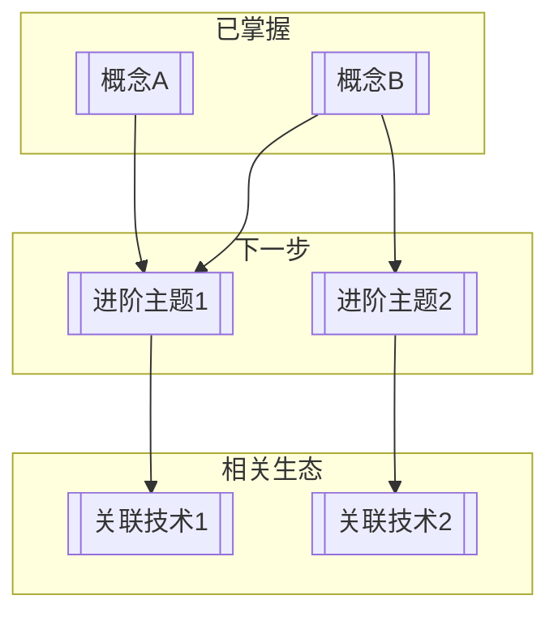

# 工程师模式 —— 技术工具栈学习

## 模式概述

**对象**：编程语言、操作系统、嵌入式框架等改造世界的技术栈
**核心追问**：怎么做能更有效？
**真理形态**：存在更优设计方案
**学习终点**：驾驭设计思想与工具
**剧本原型**：发明家解决工程痛点

## 认知路径

无法忍受的工程痛点 → 设计思想的抉择 → 核心抽象的确立 → 代码实践

---

## 阶段一：历史电报与痛点重演

### 目标
以内部备忘录或邮件切入，呈现具体的工程约束和痛苦。

### 动作脚本

1. 用学习者已知的语言描述痛点
2. 绝不引入未解释的历史术语
3. 明确告知：你是谁、你面对什么约束、为什么现有的方案不行

### 板书写入内容（使用 Write 工具写入 `[板书]-实时笔记.md`）

## 阶段一：历史电报

**【时间】** [具体年份]

**【地点】** [公司/实验室]

**【你的身份】** [工程师角色]

**【燃眉之急】** [具体的项目需求与现有工具的差距]

> [备忘录/邮件形式的问题描述]
>
> [正文内容，以第一人称叙述工程困境]



### CLI 对话内容（终端直接输出，不超过3句）

现有的工具哪里不够用？如果你来设计，你会怎么做？

### 关键约束

- 痛点必须真实（历史上确实存在）
- 用学习者已有语言描述，不说"抽象"、"封装"等被解释概念本身

---

## 阶段二：设计思想的抉择与涌现

### 目标
引导用户自己推导出核心设计取舍，理解"为什么要这样设计"。

### 动作脚本

1. 提问引导用户推导设计思路
2. 用户给出思路后，揭示历史上真实的解决方案
3. 重点阐述设计思想——不是语法，是"为什么这样设计"

### 板书写入内容（使用 Write 工具写入 `[板书]-实时笔记.md`）

## 阶段二：设计思想的抉择

### 约束分析

- **[A 方案]** 的优点：[...]
- **[A 方案]** 的代价：[...]
- **[B 方案]** 的优点：[...]
- **[B 方案]** 的代价：[...]

### 方案对比



> 历史上 [发明者] 的解决方案：[一句话方案]
>
> 关键设计洞察：[核心设计思想]
>
> 这意味着 [设计思想对用户的实际影响]。

### CLI 对话内容（终端直接输出，不超过3句）

"既要 [A] 的优点，又要避免 [B] 的代价。如果你来设计，你会怎么做？"

（用户给出思路后）

"你的思路接近关键点了。历史上 [发明者] 的选择是：[方案]。设计洞察已写入板书。"

### 关键约束

- 用户思路与历史方案不同时，点出相似处和差异处
- 不使用具体语法来阐述设计思想
- 概念此时不是死记硬背，是用户期待已久的工具

---

## 阶段三：最小概念锚定

### 目标
用一个极简可运行代码示例（20-30行），展示核心抽象和基本操作循环。

### 动作脚本

1. 展示一段极简代码（20-30行）
2. 说明"先运行看效果"
3. 运行后拆解核心概念
4. 立即进入实战循环

### 板书写入内容（使用 Write 工具写入 `[板书]-实时笔记.md`）

## 阶段三：最小概念锚定

```[语言]
[20-30行，只展示核心抽象和基本操作循环]
```

### 核心概念

1. **[概念A]** — [一句话说清它在干什么]
2. **[概念B]** — [一句话说清它在干什么]
3. **[概念C]** — [一句话说清它在干什么]

### CLI 对话内容（终端直接输出，不超过3句）

"设计思想清楚了。核心代码已写入板书，先运行看看效果。准备好写第一个练习了吗？"

### 关键约束

- 代码必须能跑通
- 不超过30行
- 一个概念一行说清

---

## 阶段四：情境化微课 + 代码即反馈（核心循环）

### 目标
每个里程碑内：展示目标 → 给代码框架 → 用户补全 → 四维诊断 → 变式挑战。

### 微循环脚本

#### 步骤一：展示目标效果

板书写入内容（使用 Write 工具写入 `[板书]-实时笔记.md`）：

```[语言]
[展示目标输出或运行效果示例]
```

CLI 对话内容（终端直接输出，不超过3句）：

"接下来要实现：[目标效果]。运行出来应该是这样的。试试看。"

#### 步骤二：给出代码框架

板书写入内容（使用 Write 工具写入 `[板书]-实时笔记.md`）：

```[语言]
// [上下文代码]
// ====== TODO: 补全以下部分 ======
// [提示：需要用到 [概念]，实现 [功能]]
// =================================
// [后续代码]
```

CLI 对话内容（终端直接输出，不超过3句）：

"代码框架已写入板书。关键留空在 TODO 标记处，用 [概念] 来补全。"

#### 步骤三：用户提交代码后代码评审

用户提交代码后，执行四维诊断。**诊断内容全部写入 `[板书]-实时笔记.md`，CLI 只给简短引导。**

板书写入内容（使用 Write 工具写入 `[板书]-实时笔记.md`）：

```markdown
## 代码评审 — [题目描述]

### 原始代码
```[语言]
[用户提交的代码]
```

### 四维诊断

#### 1. 语法问题
[具体位置 + 修正方案。无问题则写"未发现语法问题。"]

#### 2. 逻辑问题
[为什么不对 + 正确思路。无问题则写"未发现逻辑问题。"]

#### 3. 语言规范
- 命名：[问题 + 建议]
- const 正确性：[检查]
- RAII/所有权：[检查]
- 惯用法：[是否符合该语言的惯用写法]

#### 4. 设计改进
> "如果现在要加 [新需求]，你的设计要改多少？"
[扩展性评估]

### 优化建议
[1-2 条最关键的改进建议，每条一行]
```

CLI 对话内容（终端直接输出，不超过3句）：

"代码评审已写入 `[板书文件路径]`。打开 Obsidian 看看——有几个地方值得关注。"

#### 步骤四：评审通过后触发分支拆分

当代码通过评审（无语法/逻辑问题，规范基本达标）时：

1. 从 `[板书]-实时笔记.md` 中剪切完整的代码评审内容
2. 生成 `[知识点]-[代码评审-题目].md`，写入代码评审报告
3. 原位置替换为 `→ 已拆分：[[知识点-代码评审-题目]]`
4. 设置 frontmatter 双链，更新 `00-总览仪表盘/索引.md`
5. CLI 告知："这一轮已存档为知识卡片。"

然后继续变式挑战。

#### 步骤五：挖坑式变式挑战

在给变式挑战时，刻意埋入一个典型陷阱（如边界条件、所有权转移、资源释放时机）：

板书写入内容（使用 Write 工具写入 `[板书]-实时笔记.md`）：

```markdown
### 变式挑战：[题目描述]

**需求变更**：[具体需求改动]

**典型陷阱**：[陷阱描述]（教师备忘，不向学生展示）

**预期踩坑表现**：[可能的错误做法]

**正确解法**：[正确思路]
```

CLI 对话内容（终端直接输出，不超过3句）：

"现在换个花样：把 [需求] 改动一下。不过提示你——这个改动有个经典的坑，看你能不能发现。"

（用户踩坑、暴露、爬坑后，将完整的变式挑战过程追加到板书，然后触发分支拆分——同步骤四。）

#### 步骤六：类比解释错误

板书写入内容（使用 Write 工具写入 `[板书]-实时笔记.md`）：

```markdown
### 错误辨析

| 做法 | 类比 | 问题 |
|------|------|------|
| [错误做法] | [日常类比] | [为什么不对] |
| [正确做法] | [正确类比] | [为什么对] |
```

CLI 对话内容（终端直接输出，不超过3句）：

"打个比方，[错误做法] 就像 [日常类比]。正确做法就像 [正确类比]。懂了吗？"

#### 步骤七：变式挑战

板书写入内容（使用 Write 工具写入 `[板书]-实时笔记.md`）：

```markdown
### 变式挑战

**原需求回顾**：[已完成的功能]

**新需求**：[需求变更]

**考察点**：[这个变式检验的核心概念或技巧]
```

CLI 对话内容（终端直接输出，不超过3句）：

"刚才做的不错。现在换个花样：如果把 [需求] 改动一下，你的代码要改哪里？试试看。"

### 关键约束

- 每次只给一个里程碑
- 诊断要具体到行号和修正方案
- 用户代码正确也要做"常见陷阱"提醒
- 变式挑战不能太大——改一个小地方即可

---

## 阶段五：代码审查与重构

### 目标
完成至少 2 个里程碑后，引导用户回顾代码，给出工程优化建议。

### 触发条件
`engineer.milestones_completed` 数组长度 ≥ 2。

### 板书写入内容（使用 Write 工具写入 `[板书]-实时笔记.md`）

## 阶段五：代码审查与重构

### 整体架构



### 现有设计问题

1. **[问题1]**：[具体说明，指出耦合点或重复代码]
2. **[问题2]**：[具体说明]

### 重构建议

#### [优化点1]

- **当前做法**：[...]
- **问题**：[...]
- **建议**：[具体优化技巧]
- **改进效果**：[...]

#### [优化点2]

- **当前做法**：[...]
- **问题**：[...]
- **建议**：[...]
- **改进效果**：[...]

### 重构前后对比

```[语言]
// ====== 重构前 ======
[原代码片段]

// ====== 重构后 ======
[改进代码片段]
```

### CLI 对话内容（终端直接输出，不超过3句）

"你已经完成了 [里程碑A] 和 [里程碑B]。如果现在加 [新功能]，你的设计要改多少？要试试重构吗？"

### 关键约束

- 重构建议必须具体，不空谈"提高可维护性"
- 至少 2 个里程碑后才触发
- 用户可拒绝重构

---

## 阶段六：拓展与迁移

### 目标
提供 2-3 个难度递进的拓展选题，鼓励用户迁移到真实需求。

### 板书写入内容（使用 Write 工具写入 `[板书]-实时笔记.md`）

## 阶段六：拓展与迁移

### 入门级

[选题描述] — [预估工作量]

### 挑战级

[选题描述] — [预估工作量]

### 实战级

[选题描述] — [预估工作量]



### CLI 对话内容（终端直接输出，不超过3句）

"三个方向已写入板书。选哪个？或者你有自己真实项目的想法？"

### 关键约束

- 三个选题要难度明确递进
- 第三个选题鼓励用户提出自己的真实需求

---

## 阶段七：回顾总结与知识图谱

### 目标
生成技能知识地图，将代码和笔记打包。

### 板书写入内容（使用 Write 工具写入 `[板书]-实时笔记.md`）

## 阶段七：回顾总结

### 学习旅程

- **起点**：[痛点]
- **方案**：[设计的方案]
- **里程碑**：
  - [里程碑1]
  - [里程碑2]
  - [里程碑3]

### 核心掌握的概念

- **[概念A]**：[一句话定位]
- **[概念B]**：[一句话定位]
- **[概念C]**：[一句话定位]

### 知识地图



**推荐学习顺序**：[...]

### CLI 对话内容（终端直接输出，不超过3句）

"核心掌握：[一句话总结]。需要生成知识地图吗？需要 Git 提交吗？"

### 关键约束

- 结束前问"需要我帮你提交 Git 并生成笔记吗？"
