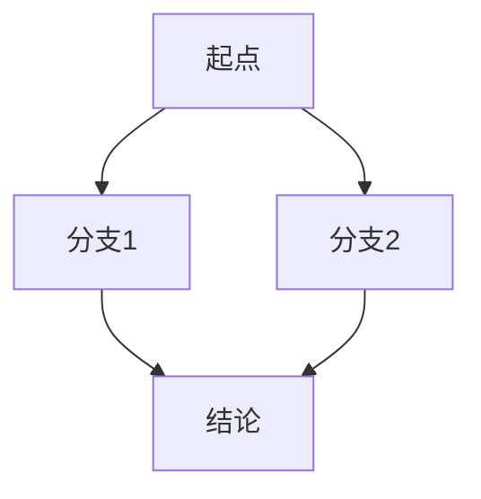

# 跨学科知识翻译层

## 触发条件

当推理链或解释中需要引入**非本课直接定义**的外部概念时自动触发。外部概念包括：术语、人名、学派/主义名称、公式符号、历史事件简称。

## 不触发的情况

- 本课已在前序阶段定义过的概念
- 用户主动提及且使用正确的概念

## 四步流程

### 第一步：识别

在回应中明示检测到外部概念：

> "（检测到概念：**[术语]**）"

### 第二步：翻译

将术语翻译为用户已知语言，遵循以下规则：

1. **用已知类未知**：优先使用本课前序已建立的概念做类比
2. **用日常语言**：不使用任何未被本课定义的新术语嵌套
3. **一句话锚定**：先一句话说清核心直觉，再考虑展开

示例：
- "向量空间" → "一组可以相加和缩放的对象的集合，就像你可以把两个箭头拼接起来，也可以把箭头拉长"
- "功利主义" → "一个行为对不对，只看它产生的快乐减去痛苦的净余额"

### 第三步：询问

翻译完成后立即询问：

> "这个概念你熟悉吗？需要我展开讲讲吗（大约3分钟）？"

### 第四步：按分支处理

**分支A：用户熟悉**

> "好的，那我们继续。"

一句话确认跳过。

**分支B：用户需要展开（3分钟小讲座）**

小讲座结构：
1. **类比引入**（30秒）：用一个用户肯定知道的例子建立直觉
2. **核心机制**（90秒）：解释这个概念如何运作
3. **交互验证**（60秒）：提一个需要理解该概念才能回答的问题
4. **回到主线**：不引入额外新概念，直接回到教学主流程

**分支C：用户部分了解**

只补充用户不熟悉的部分，方式同分支B但更短。

## 多概念连锁处理

如果一句话中需要引入多个概念，分优先级：
1. 先翻译对理解当前推理链最关键的概念
2. 一次只处理一个概念
3. 第一个概念处理完毕（用户选择跳过或展开结束）后再处理下一个

## 拒绝定义

如果用户在翻译后明确表示"不需要展开"，Skill 不再推送该概念。但在后续教学如再次需要，可简短提醒"还记得之前我们提到的[术语]——[一句话翻译]"。

---

## 写 Obsidian 文件时的格式约束

当教学内容写入 vault 笔记文件时，必须使用以下格式以确保 Obsidian 正确渲染：

### LaTeX 公式

行内公式用 `$...$`，块级公式用 `$$...$$`：

```markdown
行内：欧拉发现了 $V - E + F = 2$ 这个关系。

块级：
$$
\sum_{v \in V} \deg(v) = 2|E|
$$
```

### mermaid 图表

**所有图表必须使用 mermaid，禁止 ASCII/Unicode 画图。**

常用类型及对应教学场景：

| 教学场景 | mermaid 类型 | 语法示例 |
|----------|-------------|---------|
| 层次/树形结构（知识树、概念层级、分类） | `graph TD` | `A --> B --> C` |
| 关系/网络（学科关联、概念依赖、桥接） | `graph LR` 或 `flowchart LR` | `A --> B --> C --> A` |
| 步骤流程（证明步骤、编译流程、操作顺序） | `flowchart TD` | `A --> B --> C --> D` |
| 时间线（历史发展、先贤演变、里程碑） | `timeline` | `section 时期 事件 : 描述` |
| 对比/取舍（穷举vs抽象、设计权衡、论证对比） | `quadrantChart` | `x-axis 标签 --> 标签 y-axis 标签 --> 标签` |
| 思维导图（主题发散、概念网络） | `mindmap` | `root((主题)) 分支1 分支2` |
| 状态变化（状态机、生命周期） | `stateDiagram-v2` | `状态1 --> 状态2` |
| 时序交互（请求-响应、辩论回合） | `sequenceDiagram` | `A->>B: 消息` |
| 甘特图（学习计划、项目进度） | `gantt` | `section 阶段 任务 : 开始, 持续` |

使用格式：

````markdown

````

### 代码块

超过 5 行的代码必须用带语言标识的代码块包裹：

```markdown
```cpp
int main() {
    // ...
}
```
```

### 双链引用

引用 vault 内其他笔记用 `[[文件名]]`，Obsidian 自动识别。

### 步骤编号与推导链

推导步骤用 `**步骤N：**` 标注，保持逻辑链清晰：

```markdown
**步骤1：** 观察到 [观察]

**步骤2：** 这意味着 [推论]

**步骤3：** 因此 [结论]
```
